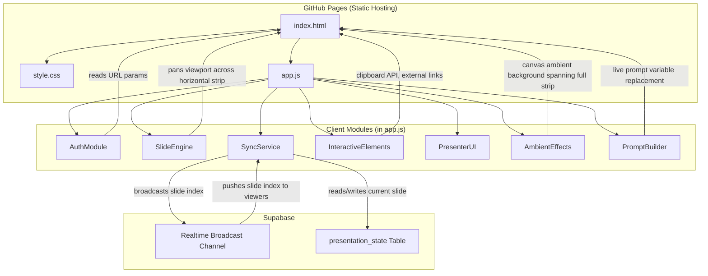
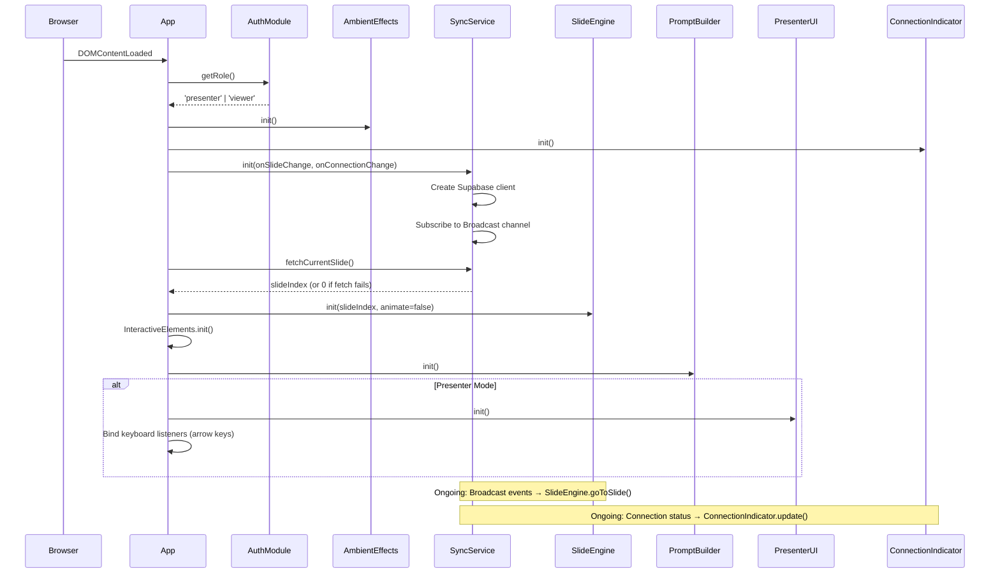
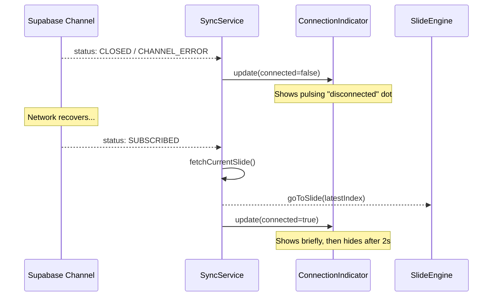

# Design Document: AI Ad Presentation

## Overview

This design describes a single-page, browser-based synchronized presentation app for a talk on optimizing Facebook ads with AI tools. The app is built with vanilla HTML, CSS, and JavaScript (no build step), deployed to GitHub Pages, and uses Supabase Realtime for live slide synchronization between a presenter and up to 50 concurrent viewers.

The presentation is designed as a **continuous horizontal canvas** — all 14 slides are laid out side-by-side in a single horizontal strip. Navigation pans the viewport across this strip, creating the illusion of one seamless, flowing visual experience rather than discrete slides. Background elements, decorative lines, and gradient orbs span across slide boundaries so transitions feel like scrolling through a panorama.

The presenter authenticates via a secret key in the URL query string (`?role=presenter&key=SECRET`). Once authenticated, the presenter sees navigation controls (next/prev buttons, keyboard arrows) and a slide counter. Viewers see only the current panel — no controls — and are kept in sync via Supabase Realtime Broadcast. A small Supabase `presentation_state` table ensures late joiners land on the correct panel.

Slides feature interactive elements including a **dynamic prompt builder** (where viewers type in their own product, audience, and industry to customize prompts in real-time before copying), copy-to-clipboard buttons, external tool links, and example ad creative mockups. The visual aesthetic is premium dark with restrained accent colors and subtle ambient motion.

## Architecture

The app follows a simple client-only architecture with Supabase as the sole backend dependency.

```
Project Root (GitHub Pages root)
├── index.html          # Single HTML file with all 14 slides in a horizontal strip
├── style.css           # All styles (separated for maintainability)
├── app.js              # All application logic (modules below)
└── assets/             # Optional: AI-generated images if provided
    └── (placeholder)
```



### Key Architectural Decisions

1. **Three files (HTML + CSS + JS)**: CSS is separated into `style.css` for maintainability given the visual complexity. Still no build step — just three static files.

2. **Horizontal strip layout**: All 14 slides are laid out in a single `#slide-strip` container with `display: flex` and `width: 1400vw`. The `#slide-viewport` is `100vw × 100vh` with `overflow: hidden`. Navigation translates the strip via `transform: translateX(-N * 100vw)`. This creates the continuous canvas effect — no individual slide shows/hides.

3. **Module pattern in a single JS file**: All logic lives in `app.js` organized as plain objects/closures (AuthModule, SlideEngine, SyncService, InteractiveElements, PresenterUI, AmbientEffects, PromptBuilder). No ES module imports — the Supabase client loads from CDN via `<script>` tag.

4. **Supabase Realtime Broadcast for sync**: Broadcast is ephemeral pub/sub — no database writes per slide change for real-time sync. The `presentation_state` table is only written to for late-joiner support (one upsert per navigation).

5. **No server-side logic**: Authentication is client-side only (secret key comparison). Acceptable because worst case is someone finding the key and navigating slides.

6. **Inline SVGs for all illustrations**: No external image dependencies. All decorative graphics (icons, diagrams, example creatives) are inline SVG or CSS-generated. This keeps deployment dependency-free and ensures crisp rendering at all resolutions.

7. **Ambient background on canvas spanning full strip**: A canvas element matches the full width of the horizontal strip (1400vw), not just the viewport. Gradient orbs drift across the entire canvas, so they're visible during transitions and create continuity between panels.

8. **PromptBuilder is local-only**: The dynamic prompt builder on Slide 9 stores its state in the viewer's browser only. It is not synchronized via Supabase. Each viewer fills in their own values independently.

## Components and Interfaces

### AuthModule

Responsible for reading URL query parameters and determining the user's role.

```javascript
const AuthModule = {
  PRESENTER_KEY: 'SECRET_KEY_HERE', // configurable constant

  /**
   * Parses URL params and returns the role.
   * @returns {'presenter' | 'viewer'}
   */
  getRole() { /* ... */ },

  /**
   * Returns true if the current user is the presenter.
   * @returns {boolean}
   */
  isPresenter() { /* ... */ }
};
```

### SlideEngine

Manages the horizontal strip position and pan transitions. Instead of showing/hiding individual slides, it translates the entire strip to bring the target panel into the viewport.

```javascript
const SlideEngine = {
  currentIndex: 0,
  totalSlides: 14,
  stripElement: null,  // The #slide-strip element
  isTransitioning: false,

  /**
   * Initializes the engine: caches the strip element, sets initial position.
   * @param {number} initialIndex - Starting slide index (0-based)
   * @param {boolean} animate - Whether to animate the initial pan
   */
  init(initialIndex, animate) { /* ... */ },

  /**
   * Pans the strip to bring the target slide into the viewport.
   * Uses transform: translateX(-index * 100vw).
   * If a transition is in progress, smoothly redirects toward the new target
   * (updates the transform target — CSS transition handles the interpolation).
   * @param {number} index - Target slide index (0-based)
   * @param {boolean} [animate=true] - Whether to use transition animation
   */
  goToSlide(index, animate) { /* ... */ },

  /** Advances to the next slide. */
  next() { /* ... */ },

  /** Returns to the previous slide. */
  prev() { /* ... */ },

  /**
   * Returns true if navigation in the given direction is possible.
   * @param {'next' | 'prev'} direction
   * @returns {boolean}
   */
  canNavigate(direction) { /* ... */ },

  /**
   * Returns the current slide index.
   * @returns {number}
   */
  getCurrentIndex() { /* ... */ }
};
```

### SyncService

Handles Supabase Realtime Broadcast, State_Store interactions, and reconnection logic.

```javascript
const SyncService = {
  supabase: null,
  channel: null,
  isConnected: false,

  // Configurable constants — replace before deployment
  SUPABASE_URL: 'YOUR_SUPABASE_URL',
  SUPABASE_ANON_KEY: 'YOUR_SUPABASE_ANON_KEY',
  CHANNEL_NAME: 'presentation',
  TABLE_NAME: 'presentation_state',

  /**
   * Initializes the Supabase client and Realtime channel.
   * Subscribes to channel status events for reconnection handling.
   * @param {function} onSlideChange - Callback when a new slide index is received
   * @param {function} onConnectionChange - Callback for connection status changes (boolean)
   */
  init(onSlideChange, onConnectionChange) {
    // 1. Create Supabase client
    // 2. Create channel and subscribe to 'slide_change' broadcast events
    // 3. Listen for channel status: on 'SUBSCRIBED' set connected,
    //    on 'CLOSED'/'CHANNEL_ERROR' set disconnected and trigger onConnectionChange
    // 4. On reconnect (status transitions to SUBSCRIBED after disconnect):
    //    fetch current slide from State_Store and call onSlideChange
    /* ... */
  },

  /**
   * Fetches the current slide index from the State_Store table.
   * Returns 0 if the fetch fails (graceful degradation).
   * @returns {Promise<number>}
   */
  async fetchCurrentSlide() { /* ... */ },

  /**
   * Broadcasts the current slide index and persists it to State_Store.
   * Broadcast failure is non-blocking. State_Store write failure is logged.
   * @param {number} slideIndex
   */
  async publishSlide(slideIndex) { /* ... */ },

  /**
   * Cleans up the channel subscription.
   */
  destroy() { /* ... */ }
};
```

### PromptBuilder

Handles the dynamic prompt customization on Slide 9. Viewers type values into input fields, and all prompt cards update in real-time.

```javascript
const PromptBuilder = {
  fields: {},       // { 'product': inputElement, 'audience': inputElement, 'industry': inputElement }
  promptCards: [],  // Array of { element, template } objects

  /**
   * Prompt templates with {variable} placeholders.
   */
  TEMPLATES: {
    adCopy: 'Write 5 Facebook ad variations for {product}. Each ad should have: a scroll-stopping first line, 2-3 sentences of benefit-focused body copy, and a clear CTA. Tone: confident but not salesy. Audience: {audience}.',
    imageConcept: 'Create a clean, modern product lifestyle photo for a Facebook ad. Show {product} in a natural setting with soft lighting. Style: editorial, minimal, high-end. No text overlay.',
    hookGenerator: 'Give me 10 opening lines for a Facebook ad about {product}. Mix formats: questions, bold claims, statistics, and "did you know" style hooks. Keep each under 15 words.',
    competitorResearch: 'Analyze the top Facebook ads in the {industry} space. What hooks, visuals, and CTAs are most common? Summarize the top 5 patterns.'
  },

  /**
   * Initializes the prompt builder: binds input listeners, caches prompt card elements.
   * Listens for 'input' events on each variable field and calls renderAll().
   */
  init() { /* ... */ },

  /**
   * Returns the current values from all input fields.
   * @returns {{ product: string, audience: string, industry: string }}
   */
  getValues() { /* ... */ },

  /**
   * Renders all prompt cards by replacing {variable} placeholders with current values.
   * Empty fields render as styled placeholder text (muted color, italic).
   */
  renderAll() { /* ... */ },

  /**
   * Returns the fully resolved prompt text for a given template key,
   * with variables replaced by current values or fallback placeholder text.
   * Used by the copy button.
   * @param {string} templateKey
   * @returns {string}
   */
  getResolvedPrompt(templateKey) { /* ... */ }
};
```

### InteractiveElements

Handles copy-to-clipboard and external link behaviors.

```javascript
const InteractiveElements = {
  /**
   * Binds click handlers to all copy buttons and external links.
   * For prompt builder copy buttons, reads from PromptBuilder.getResolvedPrompt()
   * instead of data-copy-text attribute.
   */
  init() { /* ... */ },

  /**
   * Copies text to clipboard and shows confirmation.
   * Falls back to showing selectable text area if Clipboard API fails.
   * @param {HTMLElement} button - The copy button element
   * @param {string} text - The text to copy
   */
  async copyToClipboard(button, text) { /* ... */ }
};
```

### PresenterUI

Manages presenter-specific controls (only instantiated in presenter mode).

```javascript
const PresenterUI = {
  /**
   * Creates and displays presenter controls (next/prev buttons, slide counter).
   * Controls are fixed-position, semi-transparent, bottom-center of viewport.
   */
  init() { /* ... */ },

  /**
   * Updates button disabled states and slide counter text.
   * @param {number} currentIndex
   * @param {number} totalSlides
   */
  updateControls(currentIndex, totalSlides) { /* ... */ }
};
```

### ConnectionIndicator

Shows a small, non-intrusive connection status element for viewers.

```javascript
const ConnectionIndicator = {
  element: null,

  init() { /* ... */ },

  /**
   * Shows or hides the connection indicator.
   * When connection restores, shows "connected" state briefly (2s) then hides.
   * @param {boolean} connected
   */
  update(connected) { /* ... */ }
};
```

### AmbientEffects

Manages the subtle background visual effects spanning the full horizontal strip.

```javascript
const AmbientEffects = {
  canvas: null,
  ctx: null,
  animationId: null,

  /**
   * Initializes the background canvas sized to the full strip width (1400vw × 100vh).
   * Starts the ambient animation: slow-moving gradient orbs drifting across the full canvas.
   * Runs at ~30fps via requestAnimationFrame with frame skipping.
   */
  init() { /* ... */ },

  /**
   * Stops the animation loop.
   */
  destroy() { /* ... */ }
};
```

### App (Orchestrator)

Top-level initialization that wires everything together.

```javascript
const App = {
  async init() {
    // 1. AuthModule.getRole()
    // 2. AmbientEffects.init()
    // 3. ConnectionIndicator.init()
    // 4. SyncService.init(onSlideChange, onConnectionChange)
    // 5. const initialSlide = await SyncService.fetchCurrentSlide()
    // 6. SlideEngine.init(initialSlide, animate=false)
    // 7. InteractiveElements.init()
    // 8. PromptBuilder.init()
    // 9. if (presenter) { PresenterUI.init(); bind keyboard listeners }
  }
};

document.addEventListener('DOMContentLoaded', () => App.init());
```

### Initialization Flow



### Reconnection Flow



## Data Models

### Horizontal Strip Layout (HTML)

All slides are laid out as panels in a flex row. The viewport is a fixed-size window that pans across the strip.

```html
<div id="slide-viewport">
  <canvas id="ambient-bg"></canvas>

  <div id="slide-strip">
    <section class="slide" data-slide="0">
      <!-- Slide 1: Title — AI-Powered Ad Creatives -->
    </section>
    <section class="slide" data-slide="1">
      <!-- Slide 2: The #1 Lever You Control -->
    </section>
    <!-- ... slides 2-13 ... -->
  </div>
</div>

<!-- Connection indicator (viewer only) -->
<div id="connection-indicator" class="hidden"></div>

<!-- Presenter controls (presenter only, injected by PresenterUI) -->
```

### Prompt Builder HTML (Slide 9)

```html
<section class="slide" data-slide="8">
  <div class="slide-content">
    <h2>Build Your Prompt</h2>

    <div class="prompt-variables">
      <div class="variable-field">
        <label for="var-product">Your product/service</label>
        <input type="text" id="var-product" data-var="product"
               placeholder="e.g., online fitness coaching" />
      </div>
      <div class="variable-field">
        <label for="var-audience">Target audience</label>
        <input type="text" id="var-audience" data-var="audience"
               placeholder="e.g., busy professionals aged 30-45" />
      </div>
      <div class="variable-field">
        <label for="var-industry">Industry</label>
        <input type="text" id="var-industry" data-var="industry"
               placeholder="e.g., health & fitness" />
      </div>
    </div>

    <div class="prompt-cards">
      <div class="prompt-block" data-template="adCopy">
        <h4>Ad Copy Prompt</h4>
        <pre class="prompt-text"><!-- rendered by PromptBuilder --></pre>
        <button class="copy-btn" data-prompt-key="adCopy">
          <svg><!-- clipboard icon --></svg> Copy Prompt
        </button>
      </div>
      <!-- ... more prompt blocks for imageConcept, hookGenerator, competitorResearch -->
    </div>
  </div>
</section>
```

### presentation_state Table (Supabase)

A single-row table that stores the current slide index for late joiners.

| Column       | Type      | Description                          |
|-------------|-----------|--------------------------------------|
| id          | integer   | Primary key, always `1` (single row) |
| slide_index | integer   | Current slide index (0-based)        |
| updated_at  | timestamp | Last update timestamp (auto-updated) |

SQL to create:

```sql
CREATE TABLE presentation_state (
  id integer PRIMARY KEY DEFAULT 1,
  slide_index integer NOT NULL DEFAULT 0,
  updated_at timestamp with time zone DEFAULT now(),
  CONSTRAINT single_row CHECK (id = 1)
);

-- Auto-update the updated_at column on every write
CREATE OR REPLACE FUNCTION update_updated_at_column()
RETURNS TRIGGER AS $$
BEGIN
  NEW.updated_at = now();
  RETURN NEW;
END;
$$ LANGUAGE plpgsql;

CREATE TRIGGER set_updated_at
  BEFORE UPDATE ON presentation_state
  FOR EACH ROW
  EXECUTE FUNCTION update_updated_at_column();

-- Seed the single row
INSERT INTO presentation_state (id, slide_index) VALUES (1, 0);

-- Row Level Security: allow anonymous reads and updates (no insert/delete)
ALTER TABLE presentation_state ENABLE ROW LEVEL SECURITY;

CREATE POLICY "Allow anonymous read" ON presentation_state
  FOR SELECT USING (true);

CREATE POLICY "Allow anonymous update" ON presentation_state
  FOR UPDATE USING (true);
```

### Broadcast Message Format

```javascript
{
  type: 'broadcast',
  event: 'slide_change',
  payload: {
    slideIndex: 5  // 0-based index
  }
}
```

### CSS: Horizontal Strip Layout and Transitions

```css
#slide-viewport {
  width: 100vw;
  height: 100vh;
  overflow: hidden;
  position: relative;
}

#slide-strip {
  display: flex;
  width: calc(14 * 100vw); /* 14 slides */
  height: 100vh;
  transition: transform 600ms cubic-bezier(0.22, 1, 0.36, 1);
  will-change: transform;
}

.slide {
  flex: 0 0 100vw;
  width: 100vw;
  height: 100vh;
  overflow-y: auto; /* allow vertical scroll within a panel if content is tall */
  position: relative;
}

/* No-animation for initial load / late joiners */
#slide-strip.no-transition {
  transition: none !important;
}
```

The SlideEngine sets `transform: translateX(-${index * 100}vw)` on the strip. Because CSS transitions are declarative, changing the transform target mid-transition causes the browser to smoothly redirect toward the new position — no manual cancellation needed.

### Visual Design Tokens

```css
:root {
  /* Backgrounds */
  --bg-primary: #0a0a0f;
  --bg-secondary: #12121a;
  --bg-card: rgba(255, 255, 255, 0.03);
  --bg-card-border: rgba(255, 255, 255, 0.06);

  /* Accents */
  --accent-blue: #00d4ff;
  --accent-cyan: #00f0ff;
  --accent-violet: #8b5cf6;
  --accent-gradient: linear-gradient(135deg, #00d4ff, #8b5cf6);

  /* Text */
  --text-primary: #f0f0f5;
  --text-secondary: #a0a0b0;
  --text-muted: #606070;

  /* Signals (for winner/loser comparison on Slide 6) */
  --signal-positive: #22c55e;
  --signal-negative: #6b7280;

  /* Typography */
  --font-display: 'Inter', system-ui, -apple-system, sans-serif;
  --font-mono: 'JetBrains Mono', 'Fira Code', monospace;

  /* Spacing */
  --slide-padding: clamp(2rem, 5vw, 6rem);

  /* Transitions */
  --transition-fast: 200ms ease;
  --transition-normal: 300ms ease;
}
```

### Ambient Background Effect

The ambient canvas spans the full strip width so orbs are visible during panning.

```javascript
// Canvas width = 14 * viewport width
// Canvas is positioned inside #slide-strip so it moves with the strip
// OR: canvas is fixed to viewport but renders orbs at strip-relative positions,
//     offset by the current strip translation

// Simplified concept:
function drawOrb(ctx, x, y, radius, color) {
  const gradient = ctx.createRadialGradient(x, y, 0, x, y, radius);
  gradient.addColorStop(0, color + '15');
  gradient.addColorStop(1, color + '00');
  ctx.fillStyle = gradient;
  ctx.fillRect(x - radius, y - radius, radius * 2, radius * 2);
}

// Orbs drift using sine/cosine motion across the full strip width
// Frame rate limited to ~30fps
```

### Cross-Panel Decorative Continuity

To make the continuous canvas feel seamless:

```css
/* Thin horizontal accent line that runs across the full strip */
#slide-strip::before {
  content: '';
  position: absolute;
  top: 50%;
  left: 0;
  width: 100%;
  height: 1px;
  background: linear-gradient(90deg,
    transparent 0%,
    rgba(0, 212, 255, 0.1) 10%,
    rgba(139, 92, 246, 0.05) 50%,
    rgba(0, 212, 255, 0.1) 90%,
    transparent 100%
  );
  pointer-events: none;
}

/* Subtle dot grid pattern that spans the full strip */
#slide-strip::after {
  content: '';
  position: absolute;
  inset: 0;
  background-image: radial-gradient(rgba(255, 255, 255, 0.03) 1px, transparent 1px);
  background-size: 40px 40px;
  pointer-events: none;
}
```

### Prompt Builder Styles

```css
.prompt-variables {
  display: flex;
  gap: 1rem;
  margin-bottom: 2rem;
  flex-wrap: wrap;
}

.variable-field {
  flex: 1;
  min-width: 200px;
}

.variable-field label {
  display: block;
  font-size: 0.75rem;
  color: var(--text-muted);
  text-transform: uppercase;
  letter-spacing: 0.05em;
  margin-bottom: 0.5rem;
}

.variable-field input {
  width: 100%;
  padding: 0.75rem 1rem;
  background: rgba(255, 255, 255, 0.03);
  border: 1px solid rgba(255, 255, 255, 0.08);
  border-radius: 8px;
  color: var(--text-primary);
  font-family: var(--font-display);
  font-size: 0.9rem;
  transition: border-color var(--transition-fast);
}

.variable-field input:focus {
  outline: none;
  border-color: var(--accent-blue);
  box-shadow: 0 0 0 2px rgba(0, 212, 255, 0.1);
}

.variable-field input::placeholder {
  color: var(--text-muted);
  font-style: italic;
}

/* Placeholder text in prompts (when variable is empty) */
.prompt-text .placeholder {
  color: var(--text-muted);
  font-style: italic;
}

/* Filled-in variable text in prompts */
.prompt-text .variable-value {
  color: var(--accent-cyan);
  font-weight: 600;
}
```

### Responsive Breakpoints

```css
/* Mobile-first — base styles target >= 375px */

@media (min-width: 768px) {
  /* Tablet: larger text, 2-column grids for tool cards, prompt variables side-by-side */
}

@media (min-width: 1024px) {
  /* Desktop: full layout with generous whitespace */
}
```

### Example Ad Creative Card Design

Used on Slides 4, 7, and 10:

```css
.ad-creative-card {
  width: 300px;
  border-radius: 12px;
  overflow: hidden;
  background: var(--bg-card);
  border: 1px solid var(--bg-card-border);
  box-shadow: 0 4px 24px rgba(0, 0, 0, 0.3);
}

.ad-visual {
  height: 300px;
  background: var(--accent-gradient);
}

.ad-copy { padding: 1rem; }

.ad-headline {
  font-weight: 700;
  font-size: 1rem;
  color: var(--text-primary);
}

.ad-body {
  font-size: 0.875rem;
  color: var(--text-secondary);
  margin: 0.5rem 0;
}

.ad-cta {
  background: var(--accent-gradient);
  color: white;
  border: none;
  padding: 0.5rem 1.5rem;
  border-radius: 6px;
  font-weight: 600;
  cursor: pointer;
}
```

### Glass Card Effect (Tool Cards on Slide 8)

```css
.tool-card {
  background: rgba(255, 255, 255, 0.03);
  backdrop-filter: blur(12px);
  -webkit-backdrop-filter: blur(12px);
  border: 1px solid rgba(255, 255, 255, 0.08);
  border-radius: 12px;
  padding: 1.5rem;
  transition: border-color var(--transition-fast),
              box-shadow var(--transition-fast);
}

.tool-card:hover {
  border-color: rgba(0, 212, 255, 0.2);
  box-shadow: 0 0 20px rgba(0, 212, 255, 0.05);
}
```
